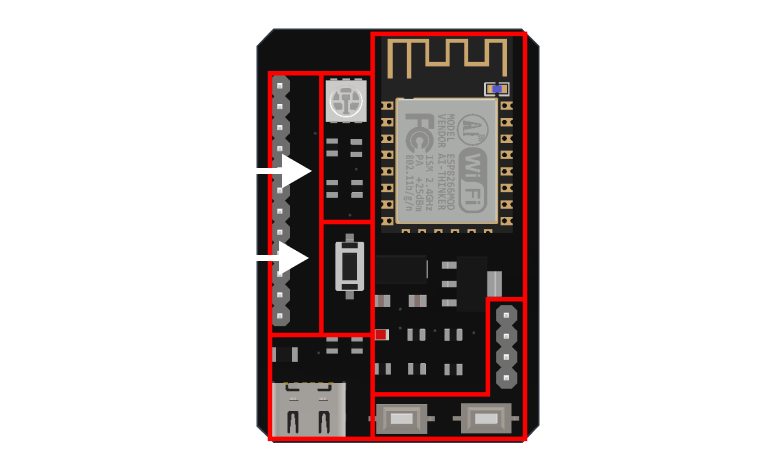

# **ESP8266 Minimum System**

## **Deskripsi**

Dokumentasi ini dibuat untuk memudahkan peserta workshop dalam memahami dan mengembangkan ESP8266 Minimum System pada Workshop Telematika 2023.

Silahkan lihat dokumentasi lengkap di:

- [Hardware](hardware/)
- [Firmware](firmware/)

## **Fitur**

Berikut merupakan fitur-fitur yang ada pada ESP8266 Minimum System Workshop Telematika 2023:

- ESP-12F (ESP8266)
- UART Pin (5V, RX, TX, GND) untuk flashing firmware
- Regulator 3.3V
- 9 Breakout Pin digital dan analog
- USB Type-C sebagai power supply
- LED indikator power
- 1 Button yang bisa diprogram
- LED RGB yang bisa diprogram

## **Kontribusi**

Kami sangat terbuka terhadap kontribusi dari semua pihak. Jika Anda ingin berkontribusi dengan memperbaiki atau melengkapi dokumentasi ini, silahkan lakukan `pull request` terhadap repository ini.

## **Lisensi**

Dokuemntasi ini dilisensikan di bawah [MIT License](LICENSE).
