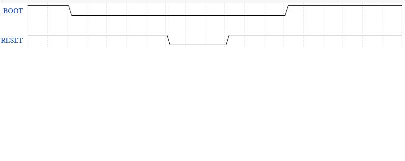
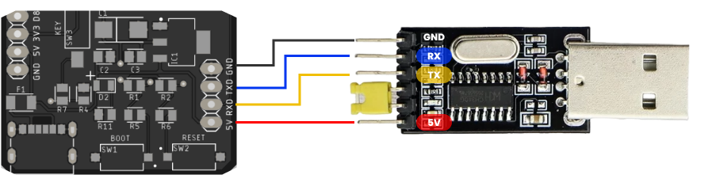

# **ESP8266 OTA**

## Persyaratan

- [Visual Studio Code](https://code.visualstudio.com/) Sebagai Code Editor
- [Ekstensi PlatformIO](https://platformio.org/install/ide?install=vscode) Sebagai Firmware Project Management
- [Minimum System ESP8266](https://github.com/B401-Robotics/wortel-firmware/tree/d97f6dfef85b5bb57e3d870195ed629ec6796cab/hardware) Sebagai Minimum System
- [Basic C/C++ Programming](https://www.geeksforgeeks.org/cpp-programming-basics/) Sebagai ilmu dasar pemrograman

## Pemrograman

Silahkan mengubah program sesuai dengan `Comment Block` yang telah disediakan pada [Source Code](https://github.com/B401-Robotics/wortel-firmware/blob/d97f6dfef85b5bb57e3d870195ed629ec6796cab/firmware/src/main.cpp)

Contoh penggunaan program yang benar

```
/* USER CODE BEGIN 1 */
pinMode(2, OUTPUT);
/* USER CODE END 1 */

/* USER CODE BEGIN 4 */
digitalWrite(2, HIGH);
/* USER CODE END 4 */
```

Contoh penggunaan program yang salah (Program diletakkan diluar `Comment Block`)

```
/* USER CODE BEGIN 1 */
pinMode(2, OUTPUT);
/* USER CODE END 1 */
pinMode(3, OUTPUT);
```

## Upload

1. Compile program menggunakan PlatformIO (`Ctrl` + `Alt` + `B`)
2. Masuk ke Bootloader ESP32 dengan menggunakan Timing diaragam sebagai berikut: `(Kedua tombol di pull-up)`  
   
   
   cara melakukannya dengan menahan tombol boot dan menekan satu kali tombol reset.
3. Upload program menggunakan PlatformIO ( `Ctrl` + `Alt` + `U` )

## Wiring ESP dengan USB-TTL

