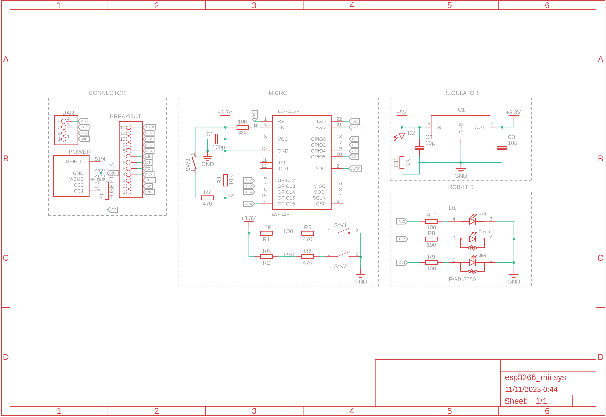
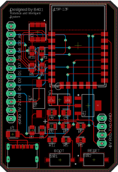
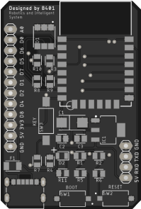
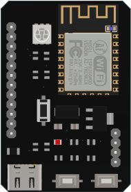
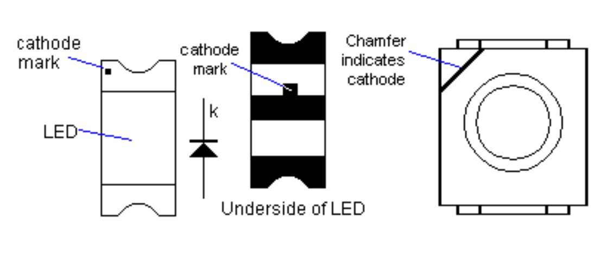

# **Hardware**

## Persyaratan

- [Eagle](https://www.autodesk.com/products/eagle/overview) (Untuk membuka file .sch dan .brd)
- [Fusion 360](https://www.autodesk.com/products/fusion-360/overview) (Opsi lain untuk membuka file)

## Schematic

Berikut adalah gambar schematic untuk ESP8266 Minimum System yang akan digunakan dalam workshop. Silakan simpan gambar ini untuk referensi Anda setelah workshop berakhir.

## Layout

Berikut ini adalah gambar layout desain hardware ESP8266 Minimum System yang akan digunakan dalam workshop. Tabel di bawah menampilkan rincian jalur PCB, hasil dari file Gerber, dan desain 3D untuk memberikan gambaran menyeluruh tentang struktur hardware yang digunakan.

<table>
    <tr>
        <th>Jalur PCB</th>
        <th>Hasil Gerber</th>
        <th>Hasil Render 3D</th>
    </tr>
    <tr>
        <td></td>
        <td></td>
        <td></td>
    </tr>
</table>

## Bill of Material

| Designator | Quantity | Package | Value |      Description      |
| :--------: | :------: | :-----: | :---: | :-------------------: |
|  R1 - R4   |    4     |  0805   |  10K  |       Resistor        |
|  R5 - R7   |    3     |  0805   |  330  |       Resistor        |
|  R8 - R10  |    3     |  0805   |  100  |       Resistor        |
|    R11     |    1     |  0805   |  1K   |       Resistor        |
|     C1     |    1     |  2412   | 100u  |   Kapasitor (Polar)   |
|  C2 - C3   |    2     |  0805   |  10u  | Kapasitor (Nonpolar)  |
|     D1     |    1     |  5050   |  RGB  |          LED          |
|     D2     |    1     |  0805   |  Red  |          LED          |
|    SW1     |    1     |    -    |   -   |    Push Button (1)    |
| SW2 - SW3  |    1     |    -    |   -   |    Push Button (2)    |
|    IC1     |    1     | SOT-223 |  3V3  | Voltage Regulator 3V3 |
|     F1     |    1     |  1206   | 750mA |         Fuse          |
|     J1     |    1     |    -    |  6P   |      USB Type-C       |

## SMD Led Polarity

SMD Led memiliki 2 kaki, yaitu kaki anoda dan kaki katoda. Perhatikan gambar di bawah ini untuk mengetahui kaki mana yang merupakan kaki anoda dan kaki katoda.

